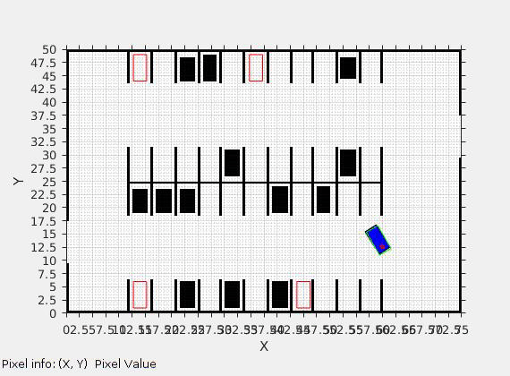

# Autonomous Vehicle Parking Planner

### Multi-Goal RRT-Connect in Parking Lot Environment



### Build and Run instructions
(from matlab command terminal)

For main planner script:
```bash
cd av-parking-planner
mex planner.cpp code/*.cpp -Icode/*.h
runplanner
```
